  

# 🎬 Awesome Media Storage & Live Video Streaming Ecosystem 🚀

> **A curated, developer-focused directory of enterprise SaaS platforms, cloud origins, low-latency live streaming servers, WebRTC infrastructure, and media transcoding tools.**

---

## 📅 Last updated: October 2026

Welcome to the **Awesome Media Storage & Live Video Streaming** directory! 🌐 This repository tracks notable commercial media storage and streaming platforms alongside open-source projects that store, transcode, package, and deliver live and on-demand video — from high-scale cloud CDNs to self-hosted WebRTC and SRT origin servers.

---

## 📑 Table of Contents
- [📊 Market Overview & Industry Dynamics](#-market-overview--industry-dynamics)
- [☁️ SaaS & Hosted Commercial Platforms](#%EF%B8%8F-saas--hosted-commercial-platforms)
- [🔓 Open-Source GitHub Projects](#-open-source-github-projects)
  - [📹 Live Streaming Servers](#-live-streaming-servers)
  - [🗄️ Media Storage & Origin Servers](#%EF%B8%8F-media-storage--origin-servers)
  - [⚙️ Transcoding, Packaging & Frameworks](#%EF%B8%8F-transcoding-packaging--frameworks)
  - [⚡ WebRTC & Real-Time Video](#-webrtc--real-time-video)
  - [📺 Media Players & Client SDKs](#-media-players--client-sdks)
- [🤝 How to Contribute](#-how-to-contribute)
- [⚠️ Disclaimer](#%EF%B8%8F-disclaimer)
- [📈 Star History](#-star-history)
- [💖 Support & Sponsorship](#-support--sponsorship)

---

## 📊 Market Overview & Industry Dynamics

> **Market Size & Structure**: The global video streaming and media storage infrastructure market is estimated at **$105.8 Billion (2026)** and projected to exceed **$250 Billion by 2030**. The sector is **moderately fragmented**: hyper-scale cloud giants (AWS, Akamai, Cloudflare) dominate high-volume CDN delivery and storage, while specialized developer-first APIs (Mux, LiveKit) and open-source engines capture rapid innovation in low-latency WebRTC and self-hosted workflows.

---

## ☁️ SaaS & Hosted Commercial Platforms

The table below lists leading managed commercial video platforms and media CDNs, sorted by company revenue / valuation in descending order.

| Platform | Description & Key Strengths | Company Scale (Revenue/Valuation) | Starting Pricing Tier | Free Tier / Trial Limit |
| :--- | :--- | :--- | :--- | :--- |
| **[AWS Elemental MediaStore](https://aws.amazon.com/mediastore/)** ☁️ | Media-optimized object storage providing low-latency origin for AWS CloudFront & MediaPackage. | **~$105 Billion** *(AWS Annual Revenue)* | $0.023 / GB stored + $0.005 per 1,000 requests | 12-Month AWS Free Tier (5 GB S3 / MediaStore storage equivalent) |
| **[Akamai Adaptive Media Delivery](https://www.akamai.com/)** 🌐 | Enterprise CDN optimized for adaptive bitrate live & VOD streaming at massive global scale. | **~$3.9 Billion** *(Annual Revenue)* | ~$2,000 / month *(Enterprise commit)* | 30-Day Free Trial (Contact Sales) |
| **[Cloudflare Stream](https://www.cloudflare.com/products/stream/)** ⚡ | End-to-end video encoding, storage, and global CDN delivery via API. | **~$1.6 Billion** *(Annual Revenue)* | $5.00 / month *(1,000 mins stored + 5,000 mins streamed)* | No permanent free tier (Included with Cloudflare Pro/Biz paid tiers) |
| **[Fastly Streaming Media](https://www.fastly.com/)** 🚀 | High-performance edge cloud CDN for real-time video delivery and low-latency live streams. | **~$530 Million** *(Annual Revenue)* | $50.00 / month *(Minimum monthly usage commit)* | $50 Free Credit one-time developer trial |
| **[Limelight Networks (Edgio)](https://www.limelight.com/)** 📡 | Global CDN and edge platform specialized for streaming, OTT, and media workloads. | **~$380 Million** *(Annual Revenue)* | ~$250.00 / month *(Standard package)* | 14-Day Free Trial |
| **[Vimeo Enterprise](https://vimeo.com/enterprise)** 🎥 | All-in-one video hosting, enterprise live streaming, security, and internal communications. | **~$410 Million** *(Annual Revenue)* | $20.00 / month *(Vimeo Starter, billed annually)* | 30-Day Free Trial (Free plan with 500 MB total limit) |
| **[Brightcove Video Cloud](https://www.brightcove.com/)** 🏢 | Enterprise OTT platform featuring monetization, analytics, DRM, and live broadcasting. | **~$200 Million** *(Annual Revenue)* | ~$499.00 / month *(Custom quote starting point)* | 30-Day Free Trial |
| **[Wowza Streaming Cloud](https://www.wowza.com/)** 🎙️ | Broadcast-grade live streaming engine and SaaS cloud platform with ultra-low latency. | **~$150 Million** *(Est. Revenue / Private)* | $99.00 / month *(Pay As You Go - 60 streaming hrs)* | 30-Day Free Trial |
| **[Mux Video](https://mux.com/)** 🛠️ | API-first video infrastructure for developers to ingest, transcode, and stream live & VOD. | **~$100 Million** *(Est. Valuation / VC Funded)* | $5.00 / 1,000 mins encoding + $0.0030/min delivery | $20 One-time Free Developer Credit (No credit card needed) |
| **[Bunny.net Stream](https://bunny.net/)** 🐰 | Cost-effective video hosting, automatic transcoding, embedded player, and global CDN. | **~$30 Million** *(Est. Revenue / bootstrapped)* | $0.01 / GB video delivery + $0.005 / GB storage | 14-Day Free Trial (Up to 1TB free bandwidth) |

---

## 🔓 Open-Source GitHub Projects

Below are top-tier open-source projects for self-hosted media storage, live video streaming servers, WebRTC infrastructure, and media processing frameworks — sorted strictly by **GitHub_Stars_Count (descending)**.

### 📹 Live Streaming Servers

-  **[SRS (Simple Realtime Server)](https://github.com/ossrs/srs)**  
  **The leading open-source live streaming server** (MIT License). High-performance, production-ready server supporting RTMP, HLS, SRT, WebRTC, and DASH. Scalable to millions of concurrent viewers. 🌟

-  **[MediaMTX](https://github.com/bluenviron/mediamtx)**  
  **Zero-dependency real-time media server & proxy** (MIT License). Ready-to-use single binary supporting RTSP, RTMP, HLS, LL-HLS, WebRTC, and SRT. Ideal for edge and IoT streaming. 🛰️

-  **[Nginx-RTMP Module](https://github.com/arut/nginx-rtmp-module)**  
  **Classic Nginx extension for RTMP/HLS live streaming** (BSD-2-Clause License). Reliable RTMP ingestion with automated HLS and DASH stream segmenting. 🔌

-  **[Owncast](https://github.com/owncast/owncast)**  
  **Self-hosted independent live streaming platform with built-in chat** (MIT License). Take full ownership of your live broadcasts without relying on Twitch or YouTube. 🎙️

-  **[Restreamer](https://github.com/datarhei/restreamer)**  
  **Self-hosted live video streaming server** (Apache-2.0 License). Easy-to-use web UI to stream video directly to your site or multi-publish to YouTube, Twitch, and Facebook. 📹

-  **[Ant Media Server](https://github.com/ant-media/Ant-Media-Server)**  
  **Ultra-low latency WebRTC streaming engine** (Apache-2.0 License). Delivers ~0.5s sub-second latency with adaptive bitrate streaming, recording, and auto-scaling. ⏱️

-  **[OvenMediaEngine](https://github.com/AirenSoft/OvenMediaEngine)**  
  **Sub-second low-latency streaming server** (AGPL-3.0 License). Built from scratch for WebRTC and Low-Latency HLS (LL-HLS) streaming to large audiences. ⚡

---

### 🗄️ Media Storage & Origin Servers

-  **[MinIO](https://github.com/minio/minio)**  
  **De-facto standard S3-compatible high-performance object storage** (AGPL-3.0 License). Ideal for media origin storage, cloud-native video chunking, and high-throughput video streaming backends. 💾

-  **[SeaweedFS](https://github.com/seaweedfs/seaweedfs)**  
  **Fast, highly scalable distributed blob & object file system** (Apache-2.0 License). Handles billions of small files and large video segments efficiently with S3 API compatibility. 🌊

-  **[Ceph](https://github.com/ceph/ceph)**  
  **Unified distributed storage cluster** (LGPL-2.1 License). Object, block, and file storage designed for petabyte-scale media repositories and cloud infrastructure. 🐋

- **[Garage](https://git.deuxfleurs.fr/Deuxfleurs/garage)** *(Self-hosted Git)*  
  **Lightweight distributed S3 object store** (AGPL-3.0 License). Specially designed for self-hosting across geo-distributed lightweight nodes. 🚗

---

### ⚙️ Transcoding, Packaging & Frameworks

-  **[OBS Studio](https://github.com/obsproject/obs-studio)**  
  **Industry standard software for video recording and live broadcasting** (GPL-2.0 License). Powerful scene composition, hardware encoding, and multi-protocol output. 🎥

-  **[FFmpeg](https://github.com/FFmpeg/FFmpeg)**  
  **The foundational multimedia framework** (LGPL/GPL License). Core CLI engine behind virtually all video transcoding, filtering, and streaming pipelines worldwide. 🛠️

-  **[GStreamer](https://github.com/gstreamer/gstreamer)**  
  **Pipeline-based multimedia framework** (LGPL License). Construct complex real-time video processing, hardware-accelerated transcoding, and streaming pipelines. ⛓️

-  **[GPAC](https://github.com/gpac/gpac)**  
  **Modular multimedia framework & MP4Box tooling** (LGPL-2.1 License). Packaging, inspection, encryption, DASH/HLS multiplexing, and playback utilities. 📦

-  **[Shaka Packager](https://github.com/shaka-project/shaka-packager)**  
  **Media packaging SDK by Google** (BSD-3-Clause License). Prepares video for VOD and Live delivery using DASH, HLS, and CMAF with DRM support. 🔒

-  **[Bento4](https://github.com/axiomatic-systems/Bento4)**  
  **Full-featured C++ MP4 format library & DASH/HLS tools** (GPL-3.0 License). Advanced segmenting, encryption, and DRM packaging for modern video delivery. 🧩

---

### ⚡ WebRTC & Real-Time Video

-  **[Jitsi Meet](https://github.com/jitsi/jitsi-meet)**  
  **Leading open-source video conferencing app** (Apache-2.0 License). Fully encrypted, scalable WebRTC multi-party video meetings with Jitsi Videobridge (SFU). 💬

-  **[LiveKit](https://github.com/livekit/livekit)**  
  **High-scale WebRTC developer platform** (Apache-2.0 License). Distributed SFU core with cross-platform client SDKs for real-time video, audio, and AI stream interactions. 🎙️

-  **[Pion WebRTC](https://github.com/pion/webrtc)**  
  **Pure Go implementation of WebRTC API** (MIT License). Native, lightweight WebRTC stack widely used in Go microservices, proxies, and custom media SFUs. 🐹

-  **[Janus WebRTC Server](https://github.com/meetecho/janus-gateway)**  
  **General-purpose WebRTC gateway** (GPL-3.0 License). Lightweight C core with pluggable architecture for video streaming, conferencing, and SIP bridging. 🚪

-  **[mediasoup](https://github.com/versatica/mediasoup)**  
  **Powerful WebRTC SFU library** (ISC License). High-performance C++ core with Node.js and Rust bindings designed for integration into custom servers. 🍲

-  **[Kurento](https://github.com/Kurento/kurento-media-server)**  
  **WebRTC media server & API framework** (Apache-2.0 License). Simplifies video processing, recording, and computer vision augmented streaming pipelines. 👁️

-  **[OpenVidu](https://github.com/OpenVidu/openvidu)**  
  **Developer platform for video call integration** (Apache-2.0 License). Provides high-level abstractions over Kurento and AWS/WebRTC engines. 📱

---

### 📺 Media Players & Client SDKs

-  **[Video.js](https://github.com/videojs/video.js)**  
  **World's most popular HTML5 video player framework** (Apache-2.0 License). Extensible player plugin ecosystem supporting HLS, DASH, skinning, and analytics. 🎮

-  **[hls.js](https://github.com/video-dev/hls.js)**  
  **JavaScript HLS client library** (Apache-2.0 License). Relies on HTML5 video and Media Source Extensions (MSE) to playback HTTP Live Streaming without plugins. 📼

-  **[Shaka Player](https://github.com/shaka-project/shaka-player)**  
  **JavaScript web player by Google for adaptive media** (BSD-3-Clause License). Plays DASH and HLS with robust EME DRM license integration. 🍿

-  **[dash.js](https://github.com/Dash-Industry-Forum/dash.js)**  
  **Official reference client implementation for MPEG-DASH** (BSD-3-Clause License). Industry standard for playing DASH streams natively in browsers. 📐

---

## 🤝 How to Contribute

Contributions are welcome! Please follow these simple guidelines:
1. **Fork** this repository.
2. Edit `README.md` to add or update relevant tools.
3. Keep descriptions concise, factual, and strictly focused on media storage, transcoding, or streaming.
4. Submit a **Pull Request** with a descriptive summary of your changes.

---

## ⚠️ Disclaimer

- This is a community-curated list maintained for educational and architectural comparison purposes.
- **Egress & Bandwidth Costs**: Live streaming and media storage consume significant outbound bandwidth. Ensure you evaluate CDN egress fees before production rollout.
- **Latency vs. Scalability**: WebRTC provides ultra-low latency (< 1s) but requires high SFU CPU power; HLS/DASH scales effortlessly to millions of clients via standard HTTP caches at the cost of 5–15 seconds of latency.
- **DRM & Licensing**: Shaka Packager and Bento4 facilitate packaging encrypted assets (Widevine, FairPlay), but key server infrastructure and commercial licenses must be obtained separately.

---

## 📈 Star History

---

## 💖 Support & Sponsorship

Thank you for exploring and utilizing this media engineering reference guide! If you find this directory helpful, please consider starring ⭐ the repo, sharing it with fellow video engineers, or contributing additions via PRs.

Your support helps maintain and update open-source developer resources across the ecosystem! ☕

---

Made with ❤️ for video engineers, cloud architects, and media developers worldwide.

